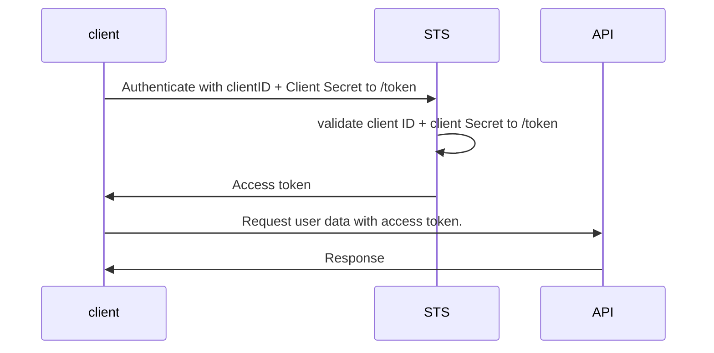
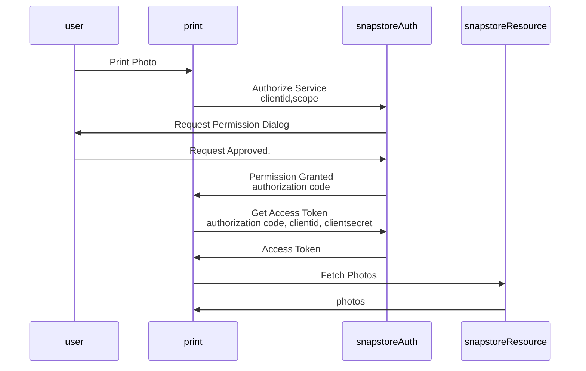

# Oauth2.0

## workflow of client credentials flow.

- client application should be registered to keycloak.

```mermaid
sequenceDiagram
    client->>STS: Authenticate with clientID + Client Secret to /token
    STS->>STS: validate client ID + client Secret to /token
    STS->>client: Access token
    client->>API: Request user data with access token.
    API->>client: Response
```

example

```mermaid
sequenceDiagram
    user->>print: Print Photo
    print->>snapstoreAuth: Authorize Service<br>clientid,scope
    snapstoreAuth->>user: Request Permission Dialog
    user->>snapstoreAuth: Request Approved.
    snapstoreAuth->>print: Permission Granted<br>authorization code
    print->>snapstoreAuth: Get Access Token<br>authorization code, clientid, clientsecret
    snapstoreAuth->>print: Access Token
    print->>snapstoreResource: Fetch Photos
    snapstoreResource->>print: photos
```
