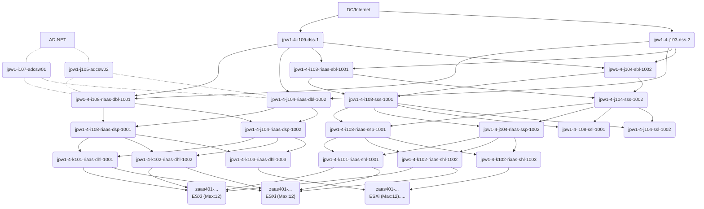

# Dgraph

## Dgraph Certificate

`dgraph cert` program creates and manages CA-signed certificate and private keys using a generated Dgraph Root CA.

1. Root CA certificate/key pair.
2. Node certificate/key pair - shared by the dgraph Alpha nodes and used for accepting TLS connection.
3. Client certificate/key pair - used by client to communicate with Dgraph Alpha server nodes.

## Define Directives and index

director.film: [uid] @reverse .
actor.film: [uid] @count .
genre: [uid] @reverse .
initial_release_date: dateTime @index(year) .
name: string @index(exact, term) @lang .
starring: [uid] .
performance.film: [uid] .
performance.character_note: string .
performance.character: [uid] .
performance.actor: [uid] .
performance.special_performance_type: [uid] .
type: [uid] .

type Person {
    name
    director.film
    actor.film
}

type Movie {
    name
    initial_release_date
    genre
    starring
}

type Genre {
    name
}

type Performance {
    performance.film
    performance.character
    performance.actor
}

## Query

### Function

#### Term matching

- allofterms(predicate,"value value")

- anyofterms(predicate,"value value")

```yaml
{
    me(func: eq(name@en, "steven spielberg"))@filter(has(director.film)){
        name@en
        director.film @filter(anyofterms(name@en,"war spies"))
        {
            name@en
        }
    }
}
```

- regular Expressions
  - schema types: string
  - index: trigram

- fuzzy matching : matches predicate values by calculating the `Levenshtein distance` to the string.
  - schema: string
  - index: trigram

- type: all nodes of specific type.

```yaml
{
    q(func: type(Animal)){
        uid
        name
    }
}
```

### Shortest Path

0x185a9

0xa9298

type Device{
    blade_host_id: Int
    is_it_switch: String
    name: String
    is_it_blade_host: String
    in_service: String
    building: String
    type: String
    device_id: Int! @id
    rack: String
    device_sub_type: String
    child_devices_name: String
    blade_device_connection: Device
    switches_connection: [Device]
    server_connection : Server
}

### JPW1 RIaaS Network

