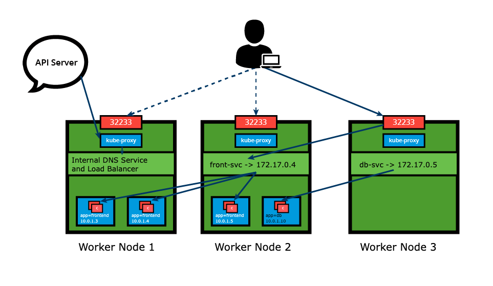
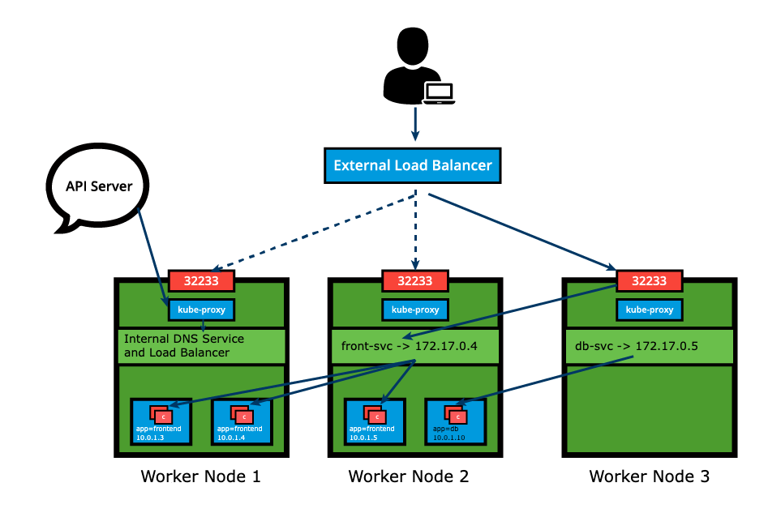
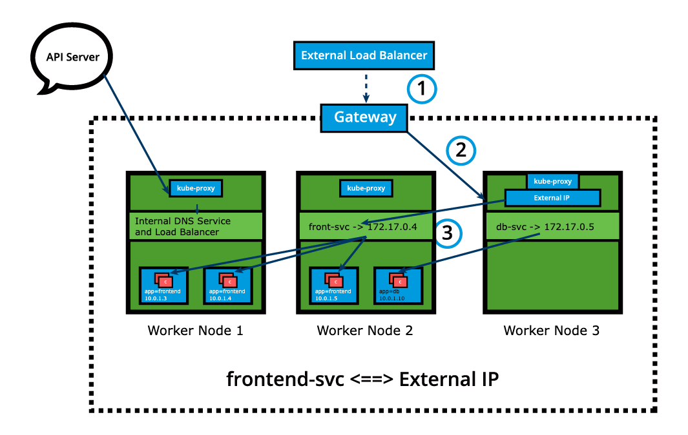
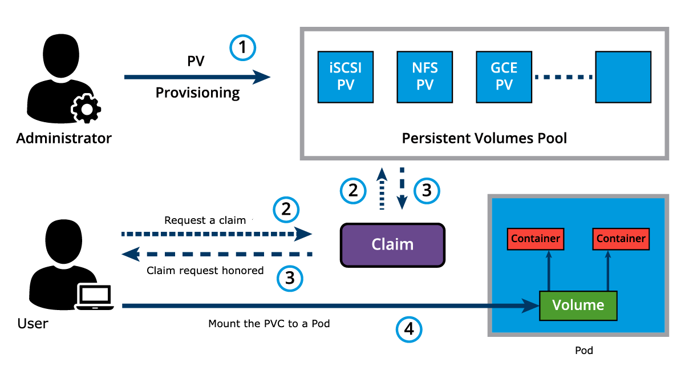
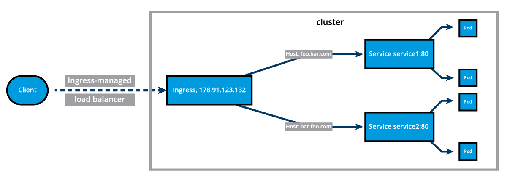

# Kubernetes

## Installation

Few Popular to go:

- [play with kubernetes](https://labs.play-with-k8s.com/)
- Minikube (for learning)
- kind
- Docker Desktop
- Microk8s
- K3s (lightweigh production)

Production ready solution:

- Kubeadm
- Kubespray
- Kops

> "Kubernetes the hard way" installation guide

## Minikube

The `minikube start` by default selects a driver isolation software, it downloads the latest kubernetes version components. with the selected driver software it provisions a single VM named **minikube** (CPU=2, Memory=6GB, Disk=20GB) or container to host the default single node all-in-one cluster.

```bash
$ minikube start driver=hyperv --v=7 --alsologtostderr
start cluster in debug mode.

$ minikube start -n 3 --driver=hyperv --container-runtime=containerd -cni=calico

$ minikube node list
list all nodes of clusters.

$ minikube node list -p minibox
list nodes of minibox cluster (-p option used to profile a cluster).

$ minikube ip
to display cluster control plane nodes IP

$ minikube profile list
view the status of all your cluster in table format  
(*) active  marker indicates the target cluster profile  
 of minikube command line tool.

$ minikube profile _____
you can set to other cluster.

$ minikube config set driver hyperv
to set default driver.

$ minikube start --driver=none
to runs kubernetes component on bare-metal (req docker).

$ minikube stop

$ minikube ip
get the IP address of the minikube VM

$ minikube service [service name] [--url]
```

### Accessing Minikube

#### 1. Command Line Interface

**kubectl** is kubernetes CLI client to manage cluster resources and applications. 

#### 2. Web-based User Interface

Kubernetes dashboard provides web-based UI to interact with a kubernete cluster to manage resources and containerized application.

```bash
$ kubectl addons list

$ kubectl addons enable metrics-server

$ kubectl addons enable dashboard
for web UI

$ kubectl dashboard [--url]
launch dashboard
```

#### 3. APIs

The main component of the kubernetes control plane is the **API Server**, responsible for exposing the kubernetes APIs. Using both CLI tools and Dashboard UI, we can access the API server running on the control plane node to perform various operations to modify the cluster's state.

HTTP API directory tree of Kubernetes can be divided into three independent group types:

- Core group (/api/v1)
    This group includes objects such as Pods, Services, Nodes, Namespaces, ConfigMaps, Secrets, etc.
- Named group
  This group includes objects in /apis/\$NAME/\$VERSION format.These different API versions imply different levels of stability and support:

  - Alpha level - it may be dropped at any point in time, without notice.
  - Beta level - it is well-tested, but the semantics of objects may change in incompatible ways in a subsequent beta or stable release
  - Stable level - appears in released software for many subsequent versions.
- System-wide
    This group consists of system-wide API endpoints, like /healthz, /logs, /metrics, /ui, etc.

Issuing the kubectl proxy command, kubectl authenticates with the API server on the control plane node and makes services available on the default proxy port 8001.

```bash
$ kubectl proxy
Starting to serve on 127.0.0.1:8001
```

When kubectl proxy is running, we can send requests to the API over the localhost on the default proxy port 8001.

```bash
$ curl http://localhost:8001/
requested all the API endpoints from API server
```

##### API with Authentication

When not using the `kubectl proxy`, we need to authenticate to the API Server when sending API requests. We can authenticate by providing a **Bearer Token** when issuing a curl command or by providing set of **keys** and **certificates**.

Let's create an access token for the *default* ServiceAccount, and grant special permission to access the root directory of the API. The special permission will be set through a Role Based Access Control(RBAC) policy.

```bash
$ export TOKEN=$(kubectl create token default)
token generated

$ kubectl create clusterrole api-access-root
    --verb=get --non-resource-url=/*

$ kubectl create clusterrolebinding api-access-root 
  --clusterrole api-access-root
  --serviceaccount=default:default

$ export APISERVER=$(kubectl config view | grep https |
    cut -f 2- -d ":" | tr -d " ")
retreive API Server endpoint

$ curl $APISERVER --header "Authorization: Bearer $TOKEN" --insecure
access the API Server
```

#### Kubectl

To access the Kubernetes cluster, the kubectl client needs the control plane node endpoint and appropriate credentials to be able to securely interact with the API Server running on the control plane node. While starting Minikube, the startup process creates, by default, a configuration file, config, inside the .kube directory (often referred to as the kubeconfig), which resides in the user's home directory. The configuration file has all the connection details required by kubectl. By default, the kubectl binary parses this file to find the control plane node's connection endpoint, along with the required credentials.

```bash
$ kubectl config view
to display the content of config file

$ kubectl cluster-info
display information about minikube k8s cluster
```

> Although for the Kubernetes cluster installed by Minikube the ~/.kube/config file gets created automatically, this is not the case for Kubernetes clusters installed by other tools. In other cases, the config file has to be created manually and sometimes re-configured to suit various networking and client/ server setups.

## Kubernetes Building Blocks

### Kubernetes Object Model

Kubernetes implemented through a rich object model, representing different persistent entities in kubernetes clusters.

With each object, we declare our intent, or the desired state of the object, in the spec section. The Kubernetes system manages the status section for objects, where it records the actual state of the object. At any given point in time, the Kubernetes Control Plane tries to match the object's actual state to the object's desired state. An object definition manifest must include other fields that specify the version of the API we are referencing as the apiVersion, the object type as kind, and additional data helpful to the cluster or users for accounting purposes - the metadata.

Examples of Kubernetes object types are Nodes, Namespaces, Pods, ReplicaSets, Deployments, DaemonSets, etc.

When creating an object, the object's configuration data section from below the spec field has to be submitted to the Kubernetes API Server. The API request to create an object must have the spec section, describing the desired state, as well as other details. Although the API Server accepts object definitions in a JSON format, most often we provide such definition manifests in a YAML format which is converted by kubectl in a JSON payload and sent to the API Server.

#### Nodes

Virtual identities assigned by kubernetes to the system part of cluster. Each node managed by two node agents - **Kubelet** and **kube-proxy**. Each host also have a container runtime, required to run all containerized workload on the node. The kubelet and kube-proxy node agents are responsible for executing all local workload management related tasks - interact with the runtime to run containers, monitor containers and node health, report any issues and node state to the API Server, and managing network traffic to containers.

Two disting types of nodes:

1. control plane - runs the control plane agents, API server, Scheduler, Controller Managers, and etcd in addition to kubelet and kube-proxy node agents, container runtime and add-ons for container networking.
2. worker - runs kubelet and kube-proxy node agents, container runtime, monitoring, logging, DNS, etc.

Node identities are created and assigned during the cluster bootstrapping process by the tool responsible to initialize the cluster agents. Minikube is using the default kubeadm bootstrapping tool, to initialize the control plane node during the init phase and grow the cluster by adding worker or control plane nodes with the join phase.

#### Namespaces

If multiple users and teams use the same Kubernetes cluster we can partition the cluster into virtual sub-clusters using Namespace.

```bash
$ kubectl get namespaces
default
kube-public
kube-system

$ kubectl --namepace kube-system get pods
list pods in kube-system namespace

$ kubectl create namespace new-namespace-name

$ kubectl create namespace demo 
```

How to switch netween namespaces?

```bash
$ kubectl config get-contexts
list which namespace  you are using.

$ kubectl config set-context kubesys --namespace=kube-system --user=kubernetes-admin --cluster=kubernetes

(or)

$ kubectl config set-context --current --namespace=<namespace-name>
it switches to other namespace

$ kubectl config get-contexts

$ kubectl config current-context

$ kubectl config use-context kubesys

```

#### Pods

Pod is the smallest kubernetes workload object. It is the unit of deployment in Kubernetes, which represents a single instance of the application. Pods are ephemeral in nature, and they do not have the capability to self-heal themselves. That is the reason they are used with controllers, or operators, which handle Pods' replication, fault tolerance, self-healing, etc.

##### Simple Pod configuration

```yaml
apiVersion: v1
kind: pod
metadata:
  name: nginx-pod
  labels:
    run: nginx-pod
spec:
  containers:
  - name: nginx 
    image: nginx:1.22.1
    ports: 
    - containerPort: 80
```

#### Labels

Labels are key-value pair attached to kubernetes objects. Used to organize and select a subset of objects, based on the requirements in place. 

#### Label Selectors

Controllers, or operators and services, use label selectors to select a subset of objects. kubernetes support two types of selectors:

- Equality-Based Selectors (==, =, !=)
- Set-Based Selectors (not in, in, exist, ...)

#### Replication Controller

It ensure specified number of replicas of a Pod is running at any given time, by contantly comparing the actual state with the desired state of the managed application.

#### ReplicaSets

It implements the replication and self-healing aspects of the ReplicationController. ReplicaSets support both equality- and set-based Selectors, whereas ReplicationControllers only support equality-based Selectors.

##### Example of ReplicaSet object's defination

```yaml
apiVersion: apps/v1
kind: ReplicaSet
metadata:
  name: frontend
  labels:
    app: guestbook
    tier: frontend
spec:
  replicas: 3
  selector:
    matchLabels:
      app: guestbook
    template:
      metadata:
        labels:
          app: guestbook
      spec:
        containers:
        - name : phd-redis
          image: gcr.io/google_samples/gb-frontend:v3
```

#### Deployments

Deployment objects provide declarative udpates to Pods and ReplicaSets. It allows for seamless application updates and rollbacks, known as the default RollingUpdate strategy, through rollouts and rollbacks, and it directly manages its ReplicaSets for application scaling.

##### Exapmple of Deployment object's

```yaml

apiVersion : apps/v1
kind : Deployment
metadata:
  name: nginx-deployment
  labels:
    app: nginx-deployment
spec:
  replicas: 3
  selector:
    matchLabels:
      app: nginx-deployment
  template:
    metadata:
      labels:
        app: nginx-deployment
    spec:
      containers:
      - name: nginx
        image: nginx:1.20.2
        ports:
        - containerPort: 80
```

##### Deployment Rolling Update and Rollback

```bash
$ kubectl create deploy mynginx --image=nginx:1.15-alpine
deploy an nginx image

$ kubectl get deploy,rs,po -l app=mynginx

$ kubectl scale deploy mynginx --replicas=3

$ kubectl describe deploy mynginx

$ kubectl set image deployment mynginx nginx=nginx:1.16-alpine

$ kubectl rollout history deploy mynginx

$ kubectl rollout history deploy mynginx --revision=1

$ kubectl get deploy,rs,po -l app=mynginx

$ kubectl rollout undo deployment mynginx --to-revision=1
```

Now you have revision 2 and 3. revision 1 becomes 3 and no longer becomes available.

#### DaemonSets

DaemonSets are operators designed to mange node agents. They resemble ReplicaSet and Deployment operators when managing multiple Pod replicas and application updates, but the DaemonSets present a distinct feature that enforces a single Pod replica to be placed per Node, on all the Nodes.

DaemonSet operators are commonly used in cases when we need to collect monitoring data from all Nodes, or to run a storage, networking, or proxy daemons on all Nodes, to ensure that we have a specific type of Pod running on all Nodes at all times.

Whenever a Node is added to the cluster, a Pod from a given DaemonSet is automatically placed on it. Although it ensures an automated process, the DaemonSet's Pods are placed on all cluster's Nodes by the controller itself, and not with the help of the default Scheduler. When any one Node crashes or it is removed from the cluster, the respective DaemonSet operated Pods are garbage collected. If a DaemonSet is deleted, all Pod replicas it created are deleted as well.

The placement of DaemonSet Pods is still governed by scheduling properties which may limit its Pods to be placed only on a subset of the cluster's Nodes.  This can be achieved with the help of Pod scheduling properties such as nodeSelectors, node affinity rules, taints and tolerations. This ensures that Pods of a DaemonSet are placed only on specific Nodes, such as workers if desired. However, the default Scheduler can take over the scheduling process if a corresponding feature is enabled, accepting again node affinity rules.

```bash
apiVersion: apps/v1
kind: DaemonSet
metadata:
  name: fluentd-agent
  namespace: kube-system
  labels:
    k8s-app: fluentd-agent
spec:
  selector:
    matchLabels:
      k8s-app: fluentd-agent
  template:
    metadata:
      labels:
        k8s-app: fluentd-agent
    spec:
      containers:
      - name: fluentd-agent
        image: quay.io/fluentd_elasticsearch/fluentd:v2.5.2
```

### Node Selector

attach labels

```bash
$ kubectl label node kworker2.example.com demoserver=true
attached label to kworker node 2.

$ kubectl get node kworkder2.example.com --show-labels
```

How to use this label to select node?

```yaml
spec
  containers
  - image: nginx
    name: nginx
  nodeSelector:
    demoserver: "true"
```
It should provisioned the pod on kworker node 2.

```bash
$ kubectl scale deploy nginx-deploy --replica=2
it will scaled the pod on the same node kworker2.
```


## Authentication, Authorization and Admission

To access and manage Kubernetes resources or objects in the cluster, we need to access a specific API endpoint on the API server. Each access request goes through the following access control stages:

- **Authentication**
  Authenticate a user based on credentials provided as part of API requests.
- **Authorization**
  Authorizes the API requests submitted by the authenticated user.
- **Admission Control**
  Software modules that validate and/or modify user requests.

Human User -> Authentication -> Authorization -> Admission Control -> Nodes

### Authentication

Kubernetes supports two kind of users:

- **Normal Users**
  They are managed outside of the Kubernetes cluster via independent services like User/Client Certificates, a file listing usernames/passwords, Google accounts, etc.

- **Service Accounts**
  Service Accounts allow in-cluster processes to communicate with the API server to perform various operations. Most of the Service Accounts are created automatically via the API server, but they can also be created manually. The Service Accounts are tied to a particular Namespace and mount the respective credentials to communicate with the API server as Secrets.

If properly configured, Kubernetes can also support anonymous requests, along with requests from Normal Users and Service Accounts. User impersonation is also supported allowing a user to act as another user, a helpful feature for administrators when troubleshooting authorization policies.

### Authorization

After a successful authentication, users can send the API requests to perform different operations. Here, these API requests get authorized by Kubernetes using various authorization modules that allow or deny the requests.

Some of the API request attributes that are reviewed by Kubernetes include user, group, Resource, Namespace, or API group, to name a few. Next, these attributes are evaluated against policies. If the evaluation is successful, then the request is allowed, otherwise it is denied. Similar to the Authentication step, Authorization has multiple modules, or authorizers. More than one module can be configured for one Kubernetes cluster, and each module is checked in sequence. If any authorizer approves or denies a request, then that decision is returned immediately.

#### Node

Node authorization is a special-purpose authorization mode which specifically authorizes API requests made by kubelets. It authorizes the kubelet's read operations for services, endpoints, or nodes, and writes operations for nodes, pods, and events.

#### Attribute-Based Access Control (ABAC)

With the ABAC authorizer, Kubernetes grants access to API requests, which combine policies with attributes. In the following example, user bob can only read Pods in the Namespace lfs158.

```yaml
{
  "apiVersion": "abac.authorization.kubernetes.io/v1beta1",
  "kind": "Policy",
  "spec": {
    "user": "bob",
    "namespace": "lfs158",
    "resource": "pods",
    "readonly": true
  }
}
```

To enable ABAC mode, we start the API server with the --authorization-mode=ABAC option,

#### Webhook

In Webhook mode, Kubernetes can request authorization decisions to be made by third-party services, which would return true for successful authorization, and false for failure. In order to enable the Webhook authorizer, we need to start the API server with the --authorization-webhook-config-file=SOME_FILENAME.

#### Role-Based Access Control (RBAC)

In general, with RBAC we regulate the access to resources based on the Roles of individual users. In Kubernetes, multiple Roles can be attached to subjects like users, service accounts, etc. While creating the Roles, we restrict resource access by specific operations, such as create, get, update, patch, etc. These operations are referred to as verbs. In RBAC, we can create two kinds of Roles:

- Role
A Role grants access to resources within a specific Namespace.
- ClusterRole
A ClusterRole grants the same permissions as Role does, but its scope is cluster-wide.

```yaml
apiVersion: rbac.authorization.k8s.io/v1
kind: Role
metadata:
  namespace: lfs158
  name: pod-reader
rules:
- apiGroups: [""] # "" indicates the core API group
  resources: ["pods"]
  verbs: ["get", "watch", "list"]
```

The manifest defines a pod-reader role, which has access only to read the Pods of lfs158 Namespace. Once the role is created, we can bind it to users with a RoleBinding object. There are two kinds of RoleBindings:

- RoleBinding
  It allows us to bind users to the same namespace as a Role. We could also refer to a ClusterRole in RoleBinding, which would grant permissions to Namespace resources defined in the ClusterRole within the RoleBinding’s Namespace.
- ClusterRoleBinding
  It allows us to grant access to resources at a cluster-level and to all Namespaces.

```yaml
apiVersion: rbac.authorization.k8s.io/v1
kind: RoleBinding
metadata:
  name: pod-read-access
  namespace: lfs158
subjects:
- kind: User
  name: bob
  apiGroup: rbac.authorization.k8s.io
roleRef:
  kind: Role
  name: pod-reader
  apiGroup: rbac.authorization.k8s.io
```

The manifest defines a bind between the pod-reader Role and user bob, to restrict the user to only read the Pods of the lfs158 Namespace.To enable the RBAC mode, we start the API server with the --authorization-mode=RBAC option, allowing us to dynamically configure policies.

### Admission Control

Admission controllers are used to specify granular access control policies, which include allowing privileged containers, checking on resource quota, etc. We force these policies using different admission controllers, like ResourceQuota, DefaultStorageClass, AlwaysPullImages, etc. They come into effect only after API requests are authenticated and authorized.

## Service

```yaml
apiVersion: v1
kind: Service
metadata:
  name: frontend-svc
spec:
  selector:
    app: frontend
  ports:
  - protocol: TCP
    port: 80
    targetPort: 5000
```

In this example, we are creating a *frontend-svc* Service by selecting all the Pods that have the Label key=app set to value=frontend. By default, each Service receives an IP address routable only inside the cluster, known as **CluserIP**.

The user/client now connects to a service via its ClusterIP, which forwards traffic to one of the Pods attached to it. A Service provides load balancing by default while selecting the Pods for traffic forwarding.

While the Service forwards traffic to Pods, we can select the targetPort on the Pod which receives the traffic. In our example, the frontend-svc Service receives requests from the user/client on port: 80 and then forwards these requests to one of the attached Pods on the targetPort: 5000.

### kube-proxy

Each cluster node runs a daemon called kube-proxy, a node agent that watches the API server on the master node for the addition, updates and removal of Services and endpoints. **kube-proxy** is responsible for implementing the Service configuration on behalf of an administrator or developer, in order to enable traffic routing to an exposed application running in Pods. For each new service, on each node, kube-proxy configures iptables rules to capture the traffic for its ClusterIp and formwards it to one of the Service's endpoints. Therefore, any node can receive the external traffic and then route it internally in cluster based on the iptables rules. When the Service is removed, kube-proxy removes the corresponding iptables rules on all nodes as well.

### Traffic Policies

The kube-proxy node agent together with the iptables implement the load-balancing mechanism of the Service when traffic is being routed to the application Endpoints. Due to restricting characteristics of the iptables this load-balancing is random by default. This means that the Endpoint Pod to receive the request forwarded by the Service will be randomly selected out of many replicas. This mechanism does not guarantee that the selected receiving Pod is the closest or even on the same node as the requester, therefore not the most efficient mechanism. Since this is the iptables supported load-balancing mechanism, if we desire better outcomes, we would need to take advantage of traffic policies.

Traffic policies allow users to instruct the kube-proxy on the context of the traffic routing.

- The **Cluster** option allows kube-proxy to target all ready Endpoints of the Service in the load-balancing process.
- The **Local** option, however, isolates the load-balancing process to only include the Endpoints of the Service located on the same node as the requester Pod. While this sounds like an ideal option, it does have a shortcoming - if the Service does not have a ready Endpoint on the node where the requester Pod is running, the Service will not route the request to Endpoints on other nodes to satisfy the request.

### Service Discovery

As Services are the primary mode of communication between containerized applications managed by Kubernetes, it is helpful to be able to discover them at runtime. Kubernetes supports two methods for discovering Services:

#### Environment Variables

As soon as the Pod starts on any worker node, the kubelet daemon running on that node adds a set of environment variables in the Pod for all active Services.

With this solution, we need to be careful while ordering our Services, as the Pods will not have the environment variables set for Services which are created after the Pods are created.

#### DNS

Kubernetes has an add-on for DNS, which creates a DNS record for each Service and its format is my-svc.my-namespace.svc.cluster.local.

### ServiceType

while defining a service, we can also choose its access scope. We can decide whether the Service:

- is only accessible within the cluster.
- is accessible from within the cluster and the external world.
- Maps to an entity which resides either inside or outside the cluster.

> Access scope is decided by **ServiceType** property.

#### ClusterIP

default ServiceType. A service receives a virtual IP address, known as its ClusterIP. This Virtual address is used for communicating with the service and is accessible only from within the cluster.

#### NodePort

In addition to a ClusterIP, a high-port, dynamically picked from the default range 30000-32767, is mapped to the respective Service, from all worker nodes. For example, if the mapped NodePort is 32233 for the service frontend-svc, then if we connect to any worker node on port 32233, the node would redirect all the traffic to the assigned ClusterIP 172.17.0.4.



The NodePort ServiceType is useful when we want to make our Services accessible from the external world. The end-user connects to any worker node on the specified high-port, which proxies the request internally to the ClusterIP of the Service, then the request is forwarded to the applications running inside the cluster. Let's not forget that the Service is load balancing such requests, and only forwards the request to one of the Pods running the desired application.

##### Demo ClusterIp and NodePort Service Types

```bash
$ kubectl run pod-hello --image=pbitty/hello-grom:latest --port=80 --expose=true
run with exposed service

$ kubectl get po,svc,ep --show-labels

$ kubectl describe pod pod-hello | grep -i podip
```

Service endpoint is the ip of the pod.

```bash
$ minikube service -all
To list all service pod-hello does not have url because it is not exposed to the outside of the cluster how to do that use nodePort.

$ kubectl edit svc pod-hello
edit : type from clusterIp to NodePort

$ kubectl get po,svc,ep --show-labels
you will see the port 80 is mapped to high port value

$ kubectl create deployment deploy-hello --image=pbitty/hello-grom:latest --port=80 --replicas=3

$ kubectl expose deployment deploy-hello --type=NodePort
```

#### LoadBalancer

With the LoadBalancer ServiceType:

- NodePort and ClusterIP are automatically created, and the external load balancer will route to them.
- The Service is exposed at a static port on each worker node.
- The Service is exposed externally using the underlying cloud provider's load balancer feature.



The LoadBalancer ServiceType will only work if the underlying infrastructure supports the automatic creation of Load Balancers and have the respective support in Kubernetes, as is the case with the Google Cloud Platform and AWS. If no such feature is configured, the LoadBalancer IP address field is not populated, it remains in Pending state, but the Service will still work as a typical NodePort type Service.

#### ExternalIP

A service can be mapped to an ExternalIP address if it can route to one or more of the worker nodes. Traffic that is ingressed into the cluster with the ExternalIP on the Service port, get routed to one of the Service endpoints.



#### ExternalName

ExternalName is a special ServiceType that has no Selectors and does not define any endpoints. When accessed within the cluster, it returns a CNAME record of an externally configured Service.

The primary use case of this ServiceType is to make externally configured Services like my-database.example.com available to applications inside the cluster. If the externally defined Service resides within the same Namespace, using just the name my-database would make it available to other applications and Services within that same Namespace.

### Multi-Port Service

A Service resource can expose multiple ports at the same time if required. Its configuration is flexible enough to allow for multiple groupings of ports to be defined in the manifest. This is a helpful feature when exposing Pods with one container listening on more than one port, or when exposing Pods with multiple containers listening on one or more ports.

```yaml
apiVersion: v1
kind: Service
metadata:
  name: my-service
spec:
  selector:
    app: myapp
  type: NodePort
  ports:
  - name: http
    protocol: TCP
    port: 8080
    targetPort: 80
    nodePort: 31080
  - name: https
    protocol: TCP
    port: 8443
    targetPort: 443
    nodePort: 31443
```

The my-service Service resource exposes Pods labeled app==myapp with possibly one container listening on ports 80 and 443, as described by the two targetPort fields. The Service will be visible inside the cluster on its ClusterIP and ports 8080 and 8443 as described by the two port fields, and it will also be accessible to incoming requests from outside the cluster on the two nodePort fields 31080 and 31443. When manifests describe multiple ports, they need to be named as well, for clarity, as described by the two name fields with values http and https respectively.

## Deploy an Application

```yaml
apiVersion: apps/v1
kind: Deployment
metadata:
    name: webserver
    labels: nginx
spec:
    replicas: 3
    selector:
        matchLabels:
            app: nginx
    template:
        metadata:
            labels:
                app: nginx
        spec:
            - name: nginx
            image: nginx:alpine
            ports:
                - containerPort: 80
```

```bash
kubectl create -f webserver.yaml
kubectl get replicasets
kubectl get pods
```

```yaml
apiVersion: v1
kind: Service
metadata:
    name: web-service
    labels:
        app: nginx
spec:
    type: NodePort
    ports:
        - port: 80
        protocol : TCP
    selector: 
        app: nginx

```

```bash
$ kubectl create -f webserver-svc.yaml
service created
$ kubectl get services
our web-service is now created and its ClusterIp is __. In port section,  
we see a mapping of 80:31074, which means that we have reserved   
static port on the node.
$ minikube service web-service
to access our application.
```

### Liveness and Readiness Probes

While containerized applications are scheduled to run in pods on nodes across our cluster, at times the applications may become unresponsive or may be delayed during startup. Implementing Liveness and Readiness Probes allows the kubelet to control the health of the application running inside a Pod's container and force a container restart of an unresponsive application.

#### Liveness

If a container in the Pod has been running successfully for a while, but the application running inside this container suddenly stopped responding to our requests, then that container is no longer useful to us. This kind of situation can occur, for example, due to application deadlock or memory pressure. In such a case, it is recommended to restart the container to make the application available.

Rather than restarting it manually, we can use a Liveness Probe. Liveness Probe checks on an application's health, and if the health check fails, kubelet restarts the affected container automatically.

Liveness Probes can be set by defining:

- Liveness command
- Liveness HTTP request
- TCP Liveness probe.

##### liveness command

```yaml
apiVersion: v1
kind: Pod
metadata:
  labels:
    test: liveness
  name: liveness-exec
spec:
  containers:
  - name: liveness
    image: k8s.gcr.io/busybox
    args:
    - /bin/sh
    - -c
    - touch /tmp/healthy; sleep 30; rm -rf /tmp/healthy; sleep 600
    livenessProbe:
      exec:
        command:
        - cat
        - /tmp/healthy
      initialDelaySeconds: 15
      failureThreshold: 1
      periodSeconds: 5
```

The existence of the /tmp/healthy file is configured to be checked every 5 seconds using the periodSeconds parameter. The initialDelaySeconds parameter requests the kubelet to wait for 15 seconds before the first probe. When running the command line argument to the container, we will first create the /tmp/healthy file, and then we will remove it after 30 seconds. The removal of the file would trigger a probe failure, while the failureThreshold parameter set to 1 instructs kubelet to declare the container unhealthy after a single probe failure and trigger a container restart as a result.

#### Reading Probes

Sometimes, while initializing, applications have to meet certain conditions before they become ready to serve traffic. These conditions include ensuring that the dependent service is ready, or acknowledging that a large dataset needs to be loaded, etc. In such cases, we use Readiness Probes and wait for a certain condition to occur. Only then, the application can serve traffic.

## Kubernetes Volume

### Volumes

Kubernetes uses Volumes, storage abstractions that allow various storage technologies to be used by Kubernetes and offered to container in Pods as storage media. A volume is essentially a mount point on the container's file system backed by a storage medium. The storage medium, content and access mode are determined by the Volume Type.

In Kubernetes, a Volume is linked to a Pod and can be shared among the containers of that Pod. Although the Volume has the same life span as the Pod, meaning that it is deleted together with the Pod, the Volume outlives the containers of the Pod - this allows data to be preserved across container restarts.

### Volume Types

A directory which is mounted inside a Pod is backed by the underlying Volume Type. A Volume Type decides the properties of the directory, like size, content, default access modes, etc. Some examples of Volume Types are:

- emptyDir
  An empty Volume is created for the Pod as soon as it is scheduled on the worker node. The Volume's life is tightly coupled with the Pod. If the Pod is terminated, the content of emptyDir is deleted forever.  
- hostPath
  With the hostPath Volume Type, we can share a directory between the host and the Pod. If the Pod is terminated, the content of the Volume is still available on the host.
- gcePersistentDisk
  with the gcePersistentDisk Volume Type, we can mount a Google Compute Engine (GCE) persistent disk into a Pod.
- awsElasticBlockStore
  mount AWS EBS Volume into a Pod
- persistentVolumeClaim
  we can attach a persistentVolume to a Pod using a persistentVolumeClaim.

### PersistentVolumes

It provides APIs for users and administrators to manage and consume persistent storage. To manage the Volume, it uses the PersistentVolume API resource type, and to consume it, it uses the PersistentVolumeClaim API resource type.

A Persistent Volume is a storage abstraction backed by several storage technologies, which could be local to the host where the Pod is deployed with its application container(s), network attached storage, cloud storage, or a distributed storage solution. A Persistent Volume is statically provisioned by the cluster administrator.

### PersistentVolumeClaims

A PVC is a request for storage by a user. User request for PersistentVolume based on storage class, access mode, size and optionally volume mode.



## ConfigMaps and SecretKey

### ConfigMaps

It allows us to decouple the configuration details from the container image. Using ConfigMaps, we pass configuration data as key-value pairs, which are consumed by Pods or any other system components and controllers, in the form of environment variables, set of commands and arguments, or volumes. We can create ConfigMaps from literal values, from configuration files, from one or more files or directories.

#### Create ConfigMap from Literal Values

```bash
$ kubectl create configmap my-config 
 --from-literal=key1=value1 --from-literal=key2=value2
create configmap using literals.

$ kubectl get configmaps my-config -o yaml
display the configmaps 
```

#### Create ConfigMap from a definition Mainifest

```yaml

apiVersion: v1
kind: ConfigMpa
metadata:
  name: customer1
data:
  TEXT1: customer_company
  TEXT2: Welcomes You
  COMPANY: Customer1 company Technology Pct. Ltd.

```

```bash
kubectl create -f customer1-configmap.yaml
```

#### Create ConfigMap from a File

```bash
kubectl create configmap permission-config \ 
--from-file=<path/to/>permission-reset.properties
```

#### Use ConfigMaps Inside Pods: As Environment Variable

Inside a Container, we can retrieve the key-value data of an entire ConfigMap or the values of specific ConfigMap keys as environment variables.

```bash
...
  containers:
  - name: myapp-full-container
    image: myapp
    envFrom:
    - configMapRef:
      name: full-config-map
...
```

The myapp-full-container Container's environment variables receies the values of the full-config-map ConfigMap keys.

```yaml
...
  containers:
  - name: myapp-specific-container
    image: myapp
    env:
    - name: SPECIFIC_ENV_VAR1
      valueFrom:
        configMapKeyRef:
          name: config-map-1
          key: SPECIFIC_DATA
    - name: SPECIFIC_ENV_VAR2
      valueFrom:
        configMapKeyRef:
          name: config-map-2
          key: SPECIFIC_INFO
...
```

the myapp-specific-container Container's environment variables receive their values from specific key-value pairs from two separate ConfigMaps, config-map-1 and config-map-2.

#### Use ConfigMaps Inside Pods: As Volumes

We can mount a vol-config-map ConfigMap as a Volume inside a Pod. For each key in the ConfigMap, a file gets created in the mount path (where the file is named with the key name) and the respective key's value becomes the content of the file:

```bash
...
  containers:
  - name: myapp-vol-container
    image: myapp
    volumeMounts:
    - name: config-volume
      mountPath: /etc/config
  volumes:
  - name: config-volume
    configMap:
      name: vol-config-map
...
```

#### Example

The goal of the demo is to store the custom webserver index.html file in a ConfigMap object, which is mounted by the nginx container specified by the Pod template nested in the Deployment definition manifest.

```html (index.html)
<!DOCTYPE html>
<html>
<head>
<title>Welcome to GREEN App!</title>
<style>
    body {
        width: 35em;
        margin: 0 auto;
        font-family: Tahoma, Verdana, Arial, sans-serif;
        background-color: GREEN;
    }
</style>
</head>
<body>
<h1 style=\"text-align: center;\">Welcome to GREEN App!</h1>
</body>
</html>
```

```yaml (web-green-with-cm.yaml)

apiVersion: apps/v1
kind: Deployment
metadata:
  creationTimestamp: null
  labels:
    app: green-web
  name: green-web
spec:
  replicas: 1
  selector:
    matchLabels:
      app: green-web
  strategy: {}
  template:
    metadata:
      creationTimestamp: null
      labels:
        app: green-web
    spec:
      volumes:
      - name: web-config
        configMap:
          name: green-web-cm
      containers:
      - image: nginx
        name: nginx
        ports:
        - containerPort: 80
        volumeMounts:
        - mountPath: /usr/share/nginx/html
          name: web-config
status: {}

```

```bash

$ kubectl create configmap green-web-cm --from-file=index.html
create config map from file.

$ kubectl get cm

$ kubectl describe cm green-web-cm
Content of file is in the data section of ConfigMap file.

$ kubectl apply -f web-green-with-cm.yaml
deployment created

$ kubectl expose deployment green-web --type=NodePort
green-web exposed

$ minikube service list
Open in browser (background is green)
```

Similarly, create another deployment with the `blue` background.

### Secrets

the Secret object can help by allowing us to encode the sensitive information before sharing it. With Secrets, we can share sensitive information like passwords, tokens, or keys in the form of key-value pairs, similar to ConfigMaps.

#### Create a Secret from Literal Values

```bash
$ kubectl create secret generic my-password 
  --from-literal=password=mysqlpassword
create a secret called my-password.

$ kubectl get secret my-password
$ kubectl describe secret my-password
They do not reveal the content of the secret. The type is Opaque.
```

#### Create a Secret from a Definition Manifest

Create Secret from a YAML definition file. There are two types of maps for sensitive information inside a Secret: `data` and  `stirngData`.

With *data* maps, each value of a sensitive information field must be encoded using base64. If we want to have a definition manifest for our Secret, we must first create the base64 encoding of our password:

```bash
$ echo mysqlpassword | base64
bXlzcWxwYXNzd29yZAo
```

```yaml
apiVersion: v1
kind: Secret
metadata:
  name: my-password
type: Opaque
data:
  password: bXlzcWxwYXNzd29yZAo
```

With *stringData* maps, there is no need to encode the value of each sensitive information field. The value of the sensitive field will be encoded when the my-password Secret is created:

```bash
apiVersion: v1
kind: Secret
metadata:
  name: my-password
type: Opaque
stringData:
  password: mysqlpassword
```

```bash
$ kubectl create -f mypass.yaml
secret/my-password created
```

#### Create a Secret from a File

```bash
$ echo mysqlpassword | base64
bXlzcWxwYXNzd29yZAo

$ echo -n 'bXlzcWxwYXNzd29yZAo=' > password.txt

$ kubectl create secret generic my-file-password 
  --from-file=password.txt
create the Secret from the password.txt file:
```

#### Use Secrets Inside Pods

##### As Environment Variables

Secrets are consumed by Containers in Pods as mounted data volumes, or as environment variables, and are referenced in their entirety or specific key-values.

Below we reference only the password key of the my-password Secret and assign its value to the WORDPRESS_DB_PASSWORD environment variable:

```bash
....
spec:
  containers:
  - image: wordpress:4.7.3-apache
    name: wordpress
    env:
    - name: WORDPRESS_DB_PASSWORD
      valueFrom:
        secretKeyRef:
          name: my-password
          key: password
....
```

##### As Volumes

```yaml
....
spec:
  containers:
  - image: wordpress:4.7.3-apache
    name: wordpress
    volumeMounts:
    - name: secret-volume
      mountPath: "/etc/secret-data"
      readOnly: true
  volumes:
  - name: secret-volume
    secret:
      secretName: my-password
....
```

## Ingress

With Services, routing rules are associated with a given Service. They exist for as long as the Service exists, and there are many rules because there are many Services in the cluster. If we can somehow decouple the routing rules from the application and centralize the rules management, we can then update our application without worrying about its external access. This can be done using the Ingress resource.

With Ingress, users do not connect directly to a Service. Users reach the Ingress endpoint, and, from there, the request is forwarded to the desired Service.

```yaml
apiVersion: networking.k8s.io/v1 
kind: Ingress
metadata:
  annotations:
    kubernetes.io/ingress.class: "nginx"
  name: virtual-host-ingress
  namespace: default
spec:
  rules:
  - host: blue.example.com
    http:
      paths:
      - backend:
          service:
            name: webserver-blue-svc
            port:
              number: 80
        path: /
        pathType: ImplementationSpecific
  - host: green.example.com
    http:
      paths:
      - backend:
          service:
            name: webserver-green-svc
            port:
              number: 80
        path: /
        pathType: ImplementationSpecific
```

user requests to both blue.example.com and green.example.com would go to the same Ingress endpoint, and, from there, they would be forwarded to webserver-blue-svc, and webserver-green-svc, respectively.



We can also define Fanout Ingress rules, presented in the example definition and the diagram below, when requests to example.com/blue and example.com/green would be forwarded to webserver-blue-svc and webserver-green-svc, respectively:

```yaml
apiVersion: networking.k8s.io/v1
kind: Ingress
metadata:
  annotations:
    kubernetes.io/ingress.class: "nginx"
  name: fan-out-ingress
  namespace: default
spec:
  rules:
  - host: example.com
    http:
      paths:
      - path: /blue
        backend:
          service:
            name: webserver-blue-svc
            port:
              number: 80
        pathType: ImplementationSpecific
      - path: /green
        backend:
          service:
            name: webserver-green-svc
            port:
              number: 80
        pathType: ImplementationSpecific
```

The Ingress resource does not do any request forwarding by itself, it merely accepts the definitions of traffic routing rules. The ingress is fulfilled by an Ingress Controller, which is a reverse proxy responsible for traffic routing based on rules defined in the Ingress resource.

### Ingress Controller

An Ingress Controller is an application watching the Control Plane Node's API server for changes in the Ingress resources and updates the Layer 7 Load Balancer accordingly. In order to ensure that the ingress controller is watching its corresponding ingress resource, the ingress resource definition manifest needs to include an ingress class annotation with the name of the desired controller `kubernetes.io/ingress.class: "nginx"` (for an nginx ingress controller).

Starting the Ingress Controller in Minikube is extremely simple. Minikube ships with the Nginx Ingress Controller set up as an addon, disabled by default. It can be easily enabled by running the following command:

```bash
minikube addons enable ingress
```

### Example YAML file

```yaml
apiVersion: networking.k8s.io/v1 
kind: Ingress
metadata:
  annotations:
    kubernetes.io/ingress.class: "nginx"
  name: virtual-host-ingress
  namespace: default
spec:
  rules:
  - host: blue.example.com
    http:
      paths:
      - backend:
          service:
            name: webserver-blue-svc
            port:
              number: 80
        path: /
        pathType: ImplementationSpecific
  - host: green.example.com
    http:
      paths:
      - backend:
          service:
            name: webserver-green-svc
            port:
              number: 80
        path: /
        pathType: ImplementationSpecific

```

User requests to both blue.example.com and green.example.com would go to same ingress endpoint and from there the request would be forwarded to webserver-blue-svc and webserver-green-svc, respectively.

### Demo

```yaml
apiVersion: networking.k8s.io/v1 
kind: Ingress
metadata:
  annotations:
    kubernetes.io/ingress.class: "nginx"
  name: ingress-demo
  namespace: default
spec:
  rules:
  - host: blue.io
    http:
      paths:
      - pathType: ImplementationSpecific
        path: "/"
        backend:
          service:
            name: blue-web
            port:
              number: 80
  - host: green.example.com
    http:
      paths:
      - pathType: ImplementationSpecific
        path: /
        backend:
          service:
            name: green-web
            port:
              number: 80

```

```bash
kubectl apply -f ingress-demo.yaml

kubectl get ingress

kubectl describe ingress-demo

sudo bash -c "echo $(minikube ip) blue.io green.io >> /etc/hosts"
```

## Advance Topics

### Annotations

With Annotations, we can attach arbitrary non-identifying metadata to any objects, in a key-value format:

```yaml
"annotations": {
  "key1" : "value1",
  "key2" : "value2"
}
```

Unlike Labels, annotations are not used to identify and select objects.

For example, while creating a Deployment, we can add a description as seen below:

```yaml
apiVersion: apps/v1
kind: Deployment
metadata:
  name: webserver
  annotations:
    description: Deployment based PoC dates 2nd Mar'2022
....
```

```bash
$ kubectl describe deployment webserver
annotations are displayed while describing an object.
```

### Quota and Limits Management

When there are many users sharing a given Kubernetes cluster, there is always a concern for fair usage. A user should not take undue advantage. To address this concern, administrators can use the ResourceQuota API resource, which provides constraints that limit aggregate resource consumption per Namespace.

We can set the following types of quotas per Namespace:

- **Compute Resource Quota**
  We can limit the total sum of compute resources (CPU, memory, etc.) that can be requested in a given Namespace.
- **Storage Resource Quota**
  We can limit the total sum of storage resources (PersistentVolumeClaims, requests.storage, etc.) that can be requested.
- **Object Count Quota**
  We can restrict the number of objects of a given type (pods, ConfigMaps, PersistentVolumeClaims, ReplicationControllers, Services, Secrets, etc.).

### Autoscaling

While it is fairly easy to manually scale a few Kubernetes objects, this may not be a practical solution for a production-ready cluster where hundreds or thousands of objects are deployed. We need a dynamic scaling solution which adds or removes objects from the cluster based on resource utilization, availability, and requirements. 

Autoscaling can be implemented in a Kubernetes cluster via controllers which periodically adjust the number of running objects based on single, multiple, or custom metrics. There are various types of autoscalers available in Kubernetes which can be implemented individually or combined for a more robust autoscaling solution:

- Horizontal Pod Autoscaler (HPA)
- Vertical Pod Autoscaler (VPA)
- Cluster Autoscaler

### Jobs and CronJobs

A Job creates one or more Pods to perform a given task. The Job object takes the responsibility of Pod failures. It makes sure that the given task is completed successfully. Once the task is complete, all the Pods have terminated automatically. Job configuration options include:

- **parallelism** - to set the number of pods allowed to run in parallel;
- **completions** - to set the number of expected completions;
- **activeDeadlineSeconds** - to set the duration of the Job;
- **backoffLimit** - to set the number of retries before Job is marked as failed;
- **ttlSecondsAfterFinished** - to delay the cleanup of the finished Jobs.

### StatefulSets

The StatefulSet controller provides identity and guaranteed ordering of deployment and scaling to Pods. However, the StatefulSet controller has very strict Service and Storage Volume dependencies that make it challenging to configure and deploy. It also supports scaling, rolling updates, and rollbacks.

### Custom Resources

In Kubernetes, a resource is an API endpoint which stores a collection of API objects. For example, a Pod resource contains all the Pod objects.

Although in most cases existing Kubernetes resources are sufficient to fulfill our requirements, we can also create new resources using custom resources. With custom resources, we don't have to modify the Kubernetes source.

Custom resources are dynamic in nature, and they can appear and disappear in an already running cluster at any time.

To make a resource declarative, we must create and install a custom controller, which can interpret the resource structure and perform the required actions. Custom controllers can be deployed and managed in an already running cluster.

### Kubernetes Federation

With Kubernetes Cluster Federation we can manage multiple Kubernetes clusters from a single control plane. We can sync resources across the federated clusters and have cross-cluster discovery. This allows us to perform Deployments across regions, access them using a global DNS record, and achieve High Availability.

Although still a Beta feature, the Federation is very useful when we want to build a hybrid solution, with one cluster running inside our private datacenter and another one in the public cloud, allowing us to avoid provider lock-in. We can also assign weights for each cluster in the Federation, to distribute the load based on custom rules.

### Security Contexts and Pod Security Admisison

At times we need to define specific privileges and access control settings for Pods and Containers. Security Contexts allow us to set Discretionary Access Control for object access permissions, privileged running, capabilities, security labels, etc. However, their effect is limited to the individual Pods and Containers where such context configuration settings are incorporated in the spec section.

### Network Policies

Kubernetes was designed to allow all Pods to communicate freely, without restrictions, with all other Pods in cluster Namespaces. In time it became clear that it was not an ideal design, and mechanisms needed to be put in place in order to restrict communication between certain Pods and applications in the cluster Namespace. Network Policies are sets of rules which define how Pods are allowed to talk to other Pods and resources inside and outside the cluster. Pods not covered by any Network Policy will continue to receive unrestricted traffic from any endpoint. 

Network Policies are very similar to typical Firewalls. They are designed to protect mostly assets located inside the Firewall but can restrict outgoing traffic as well based on sets of rules and policies. 

The Network Policy API resource specifies podSelectors, Ingress and/or Egress policyTypes, and rules based on source and destination ipBlocks and ports. Very simplistic default allow or default deny policies can be defined as well. As a good practice, it is recommended to define a default deny policy to block all traffic to and from the Namespace, and then define sets of rules for specific traffic to be allowed in and out of the Namespace.

### Monitoring, Logging and Troubleshooting

In Kubernetes, we have to collect resource usage data by Pods, Services, nodes, etc., to understand the overall resource consumption and to make decisions for scaling a given application. Two popular Kubernetes monitoring solutions are the Kubernetes Metrics Server and Prometheus.

- **Metric server**
  Metrics Server is a cluster-wide aggregator of resource usage data - a relatively new feature in Kubernetes.
- **Prometheus**
  Prometheus, now part of CNCF (Cloud Native Computing Foundation), can also be used to scrape the resource usage from different Kubernetes components and objects. Using its client libraries, we can also instrument the code of our application.

Another important aspect for troubleshooting and debugging is logging, in which we collect the logs from different components of a given system. In Kubernetes, we can collect logs from different cluster components, objects, nodes, etc. Unfortunately, however, Kubernetes does not provide cluster-wide logging by default, therefore third party tools are required to centralize and aggregate cluster logs. A popular method to collect logs is using Elasticsearch together with Fluentd with custom configuration as an agent on the nodes. Fluentd is an open source data collector, which is also part of CNCF.

The third-party troubleshooting tools are addressing a shortcoming of Kubernetes with regards to its logging capability. Although we can extract container logs from the cluster, we are limited only to logs of currently running containers, and in the case of several consecutive container restarts due to failures - the logs of the very last failed container (using the -p or --previous flags). The logs can be displayed for a single container pod or a specific container of a multi-container pod (using the -c flag):

```bash
$ kubectl logs pod-name
logs of pod
$ kubectl logs pod-name -c container-name

$ kubectl logs pod-name -c container-name -p
```

In addition, a user can run a custom command in a running container of a pod, or interact with the running container from the terminal (using the -it flag and invoking the shell command line interpreter of the container):

```bash
$ kubectl exec pod-name -- ls -la /
enter in pod

$ kubectl exec pod-name -c container-name -- env

$ kubectl exec pod-name -c container-name -it -- /bin/sh
```

### Helm

To deploy a complex application, we use a large number of Kubernetes manifests to define API resources such as Deployments, Services, PersistentVolumes, PersistentVolumeClaims, Ingress, or ServiceAccounts. It can become counter productive to deploy them one by one. We can bundle all those manifests after templatizing them into a well-defined format, along with other metadata. Such a bundle is referred to as Chart. These Charts can then be served via repositories, such as those that we have for rpm and deb packages. 

Helm is a package manager (analogous to yum and apt for Linux) for Kubernetes, which can install/update/delete those Charts in the Kubernetes cluster.

Helm is a CLI client that may run side-by-side with kubectl on our workstation, that also uses kubeconfig to securely communicate with the Kubernetes API server. 

The helm client queries the Chart repositories for Charts based on search parameters, downloads a desired Chart, and then it requests the API server to deploy in the cluster the resources defined in the Chart.

Helm Chart is a bundle of YAML files, Supports Helm templating, Stored in Public/Private repos. Template structure of our application.

    Webapp1
    |-- Chart.yaml
    |-- templates
    |   |-- Notes.txt
    |   |-- configmap.yaml
    |   |-- deployment.yaml
    |   |-- service.yaml
    |-- values-dev.yaml
    |-- values-prod.yaml
    |-- values-qa.yaml
    `-- values.yaml

Helm v2 -> Tiller (lies in kubernetes cluster) -> Api. it follows client server model. Helm v3 -> api. directly instruct api to make changes.

```bash
$ helm repo [command]
repository management and listing helm packages.

Available commands:
  add, index, list, remove, update

$ helm install/uninstall [...]
install/uninstall a helm chart

[...] :
[name] [chart]

$ helm status <release>
gives details of a helm installation: revision#,
deployment time, current status, etc.

$ helm list [flags]
list out helm release in your environment

$ helm list -all-namespaces

$ helm status my-prometheus
```

### Service Mesh

A Service Mesh is an implementation that relies on a proxy component part of the Data Plane, which is then managed through a Control Plane. The Control Plane runs agents responsible for the service discovery, telemetry, load balancing, network policy, and gateway. The Data Plane proxy component is typically injected into Pods, and it is responsible for handling all Pod-to-Pod communication, while maintaining a constant communication with the Control Plane of the Service Mesh.

### Application Deployment Strategies

A method presented earlier for new application release rollouts was the Rolling Update mechanism supported by the Deployment operator. The Rolling Update mechanism, and its reverse - the Rollback, are practical methods to manage application updates by allowing one single controller, the Deployment, to handle all the work it involves. However, while transitioning between the old and the new versions of the application replicas, the Service exposing the Deployment eventually forwards traffic to all replicas, old and new, without any possibility for the default Service to isolate a subset of the Deployment's replicas. Because of the traffic routing challenges these update mechanisms introduce, many users may steer away from the one Deployment and one Service model, and embrace more complex deployment mechanism alternatives. 

The Canary strategy runs two application releases simultaneously managed by two independent Deployment controllers, both exposed by the same Service. The users can manage the amount of traffic each Deployment is exposed to by separately scaling up or down the two Deployment controllers, thus increasing or decreasing the number of their replicas receiving traffic. 

The Blue/Green strategy runs the same application release or two releases of the application on two isolated environments, but only one of the two environments is actively receiving traffic, while the second environment is idle, or may undergo rigorous testing prior to shifting traffic to it. This strategy would also require two independent Deployment controllers, each exposed by their dedicated Services, however, a traffic shifting mechanism is also required. Typically, the traffic shifting can be implemented with the use of an Ingress.

watch canary deployment strategy.